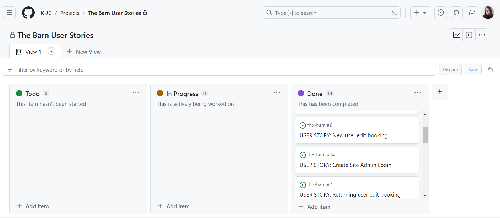

#  The Barn
The Barn Restaurant is a fictional restaurant and not a real one. 

The link to the live site can be found here, enjoy! - [The Barn]() Enjoy!

## Table of Contents  
* [Development Plane](#development-plane)
* [WireFrame](#wireframe)
* [User Stories](#user-stories)
* [Features](#features)  
* [Testing](#testing)
* [Bugs](#bugs)
* [Validator Testing](#validator-testing)
* [Deployment](#deployment)
* [Credits](#credits)

# Development Plane
## Stratagy
* I aim to achieve a restaurant booking system for users that will want to make a booking at this fictional restaurant 
* When at the first stage of planning my project I put myself in the shoes of the user, I needed to understand what the users wants or needs for this website were. I noted down the following.
* Why would the user come to this website in the first place? To find a restaurant, look at the menu, book a table, important information regarding opening hours and contact information for the restaurant.
* The first thing they should see is what this website is about (a restaurant) and it should be very clear how to navigate.
* What would make them come back after their first visit? To edit or delete their original booking. To make a new booking. Redownload a new menu.
* If the experience of navigating was straightforward and easy to use. The website looks good. This should create a good user experience.

## Scope
* The features I want to implement are the ability for a user to make a booking at the restaurant, but only once they have logged in. If a user doesn't have an account then they can't get to the booking page. Once logged in they have access to make a booking, view all their bookings, edit and delete their bookings. I would also like to have the menu as a PDF that the user can download. I would like to add styling to this so it's not just a plain document.

## Structure
* Logically grouping the main home page so that additional pages are easy to navigate through a collapsible navagation icon. This will contain the make booking,my booking,sign in, sign up, menu pages. 
* So the user will be able to navigate from the home page with ease. I aim to have most of the pages link back to the home page or to the booking page via buttons which are clear and easy to understand.

## Skeleton
* Information presented in a clear way and avoiding any clutter. The user must have an easy navigation experience. The collapsible navigation bar will take the user from the home page to other pages. 
* Only a logged in user will be able to make a booking,the user will be directed to a sign up/sign in page. Once a user is logged in they can access the make a booking page, and then from there the my booking page where they will have options to edit or delete a particular booking.
* There will be an option for the user to log out of their account too. 
* Information on the main home page will be all relevant to this restaurant, from the description to the imagery used. Social media links and opening times are some of the features that will be used. 

## Surface
* I wanted this to look visually pleasing and not overwhelm the user. By using a combination of black and goldy yellow. Google fonts of Playfair Display and a back up of sans-serif. 
* A user would visit the website, and see the logo to the left hand side with the restaurant name to the right would be a navigation drop down bar This would then drop down to reveal navigation such as log in/log out and make booking.

# Wireframe
* Once I had an idea of what the user would need, I could then begin to figure out what the website would look like. 
* I created some wireframes using Figma, this is how I visioned the home page of the website to look and the rest of the pages to keep the same visuals.
* How I planned the website to look like was to have gold like text againts a black background. Then some white background with black text for where the resturant description and imagry would go.
* Images relating to the restaurant. A description about this fictional restaurant. Black navbar and footer. Hero image to fit the width of the page, this Will blend well with the navigation color scheme I was planning to go with.
* Google fonts of Playfair Display and a back up of sans-serif I chose to use. 
* Remembering to center the text and imagery as this project was a mobile first design. 
* Would like to add a favicon to make the website more realistic. Collapsible navagation to access hidden pages. 
* Clean and clearly laid out information. Visually pleasing. Clearly labeled buttons to assist with navigating the website, for example booking button to take the user to the booking page. 
* Social media links will make this a more realistic site and a PDF download menu will make this look a more authentic resturant website experience.

* I created a rough guide of how I would like the booking pages to look, I wanted to create a form so that the user can input the information you would with any other resturant booking site, like their first and last name, how many people the table is for etc. There needed to be a clearly labeled button to direct the user to edit or delete pages. 

# User Stories 

* From the development plane and wire frame I got a good idea of what user stories I create.
* I created a GitHub project called The Barn User Stories and connected this to my project repository. The user stories are as follows.
* As a new user I can create a log in so that I can book/edit/cancel my booking
* As a new user I can download restaurant menu so that I can view the food options on my phone now or at a later date
* As a returning user I can download restaurant menu so that I can view the menu options in case they have changed
* As a new user I can book a table so that I can eat at this restaurant at a certain time/day
* As a returning user I can book a table so that I can eat at this restaurant at a certain time/day
* As a new user I can edit my booking so that I can change the time/day I eat at the restaurant or how many people are attending
* As a returning user I can edit my booking so that I can change the time/day I eat at the restaurant or how many people are attending
* As a new user I can cancel my booking so that the restaurant knows I will no longer need the table
* As a returning user I can cancel my booking so that the restaurant knows I will no longer need the table
* As a returning user I can log in so that I can book/edit/cancel a booking
* As a returning user I can log out so that I can log out of my booking account
* As a new user I can log out so that I can log out of my booking account
* As a site admin I can view all bookings made so that I can view them/edit them or cancel them if a customer rings up to change their booking
* As a site admin I can log in with admin privileges so that view bookings that have been made

# Features

# Bugs
## Solved
* When loading up my page to see if my superuser admin had been done correctly It came up with an error telling me that cloudinary-storage had no model. So when scrolling through my settings I noted that both static and media I had used a CAPITAL C instead of lower case c for cloudinary storage. Once I changed this and reloaded my browser the Django admin page loaded fine. 

* When I was trying to link my templates to my webpage, an error occurred telling me that the template I have inputted did not exist. After much going over the content of my files I noticed my folder was named template and should have been named templates. Once I corrected this my restaurant page was up and running. And that my h1 text of TEST was now visible. 

* When coming back to my project and loading up the webpage I was met with an error, that the page was a disallowed host. It advised me to add "8000-kjc-thebarn-kbsjk8ya556.ws-eu97.gitpod.io" to my allowed hosts in my settings file. Once I had done this the page loaded fine with no errors.
This happened a few more times later in my project progression so I repeated the above.
I had also forgotten to add django.contrib.sites to my settings.py file.

* When I wanted to change f_name to first_name on my models so that on my page it would show as first name and not f name. I had an error raised which said first_name does not exist. And after a lot of searching and changing code I realized that I should have migrated this change. I input show migrations and I had quite a few, once I migrated these First name was now showing instead of f name.

* Bookings once made not showing on the users my bookings page. I changed the class to a def and the  detail view for a request. I then defined bookings as I had not done this. once I had defined it so that the guest booking would show up in my booking page. I added {bookings in bookings} once I refreshed the page some of the information was showing. After some rejigging of my code, I noticed that  I had guests as bookings.guest and the other information was written up as just booking. I then changed the booking to bookings and once done, all the information on booking was now showing. A user can now view the bookings they make.

* An error occurred with my path for thankyou page. I had not placed a ‘/’ at the end so once i had entered /’thankyou’/ the page loaded correctly.

* Another bug I came across was for my edit and delete bookings class, so that the user will be able to edit or delete a booking.I was receiving  an error message “Generic detail view BookingEdit must be called with either an object pk or a slug in the URLconf”. I placed a pk after the edit_booking and delete_booking url path in urls.py and a booking.id in my edit and delete urls in my my_booking page. Page wasn't able to load as couldn't find the path. I changed the position of the pk to infront of edit_booking and delete_booking. The pages both loaded fine and once clicked on the edit button this took me to the edit page. I tried the same for the delete page, this worked fine. Then I tested that on the edit page i could change that particular booking's details, changing the time and the date, once confirmed I was then taken back to the my_booking page and the booking had indeed been updated. Again I tested that on the delete page I could delete the chosen booking, once deleted was taken back to the my_booking page where the booking had been removed. 

* The favicon wasn’t loading to the website after going over the code. It was because I had used an incorrect file path in the static folder. Once corrected the favicon was showing. 

## Unsolved Bugs
* When logged in as Teresa I made a booking. I logged out and signed up as a new user Luke. I went to make a booking for Luke and this worked as expected but what was not expected was that Teresa’s booking was also showing up. I have been unable to find a way to fix this bug with the time I had left which was disappointing.

# Future Features
* I would like to add the use of messages, so that when a user edits or deletes their booking a message would come up and disappear after 4 seconds which would say “your booking has been edited” and “your booking has been deleted”.
* I would like to add an additional menu to download.
* I would like to add a confirmation email once a user has booked with the restaurant.

# Validator Testing
* HTML - No errors found, passed on W3C HTML Validator
* CSS - No errors found, passed on W3C CSS Validator
* PEP8 Python Validator - The only error that came up were that my line of code was too long. 

# Testing
## Manual Testing 
* Through development of the project in GitPod. All buttons take me to the correct place, all font awesome links take me to the correct social media sites. Booking form works correctly and the chosen fields for the edit booking page work correctly. On the live deployed site on Heroku the website works as expected.

# Technologys Used
## Frameworks, Libraries, Programs & Applications Used
* Django
* PostgreSQL
* Bootstrap
* Cloudinary - I used Cloudinary to store images from this project.
* Font Awesome - I used Icons from Font Awesome for mmy social media links which made it more realisic site.
* Figma - I used Figma in the planning stage to create my sitemap, from this I created my website like I had designed.
* GitHub - My project was stored on Github.
* GitPod - Gitpod was used for writing my code and when I pushed commits from Gitpod they were uploaded to Github where my project was stored.
* Heroku - Where the project was deployed to.
* Google Development Tool - Where I checked the responsiveness of the website and edit any code without the risk of making it a permanent change.
* Elephantsql - I used Elephantsql for my database.

## Languages
* HTML
* CSS
* Python
* Javascript

# Accessibility
* Using Google Development tools, I tested the accessability of the site via the lighthouse option. My website scored 

# Deployment
* Steps to deploy on Heroku, I push any unsaved changes from my work to GitHub.
* From Heroku I click create new app, I then named “the-barn”, I selected my region and then clicked create app.
* Once the page loaded, I went into the settings tab, I went to the config vars section and entered PORT to the key and 8000 to the value (this was added because the mock terminal may fail and the project will not work if not entered). I entered my cloudinary url and then my database url from ElephantSQL. I entered my secret key information into the config vars. 
* I then scrolled down to the build packs section, I clicked add build pack and selected python then clicked saved changes. I then clicked back on the build pack and selected node.js then clicked saved changes again. I made sure that Python was first and then node.js.
* Next, I went to the deployment section and selected my deployment method which is GitHub. I confirmed that I wanted to connect to GitHub. I searched for my repository name which is "the-barn”. I selected this and then connected to link the Heroku app to my repository code.
* I then scrolled down and clicked deploy branch from the deploy a GitHub branch (this showed me the logs being run as my project was being deployed).
* Once completed I then clicked on view to view my deployed project on the terminal. It is loaded with no errors. I then tested my project making sure everything was working as it should and it was.

# Credits
## Media 
* All images used are from Pexels, I used Tiny PNG to compress images down and then used Cloudinary as my storage for them.[Pexels](https://www.pexels.com/)
* All icons used for my social media links are from FontAwesome.-[FontAwesome](https://fontawesome.com/)

